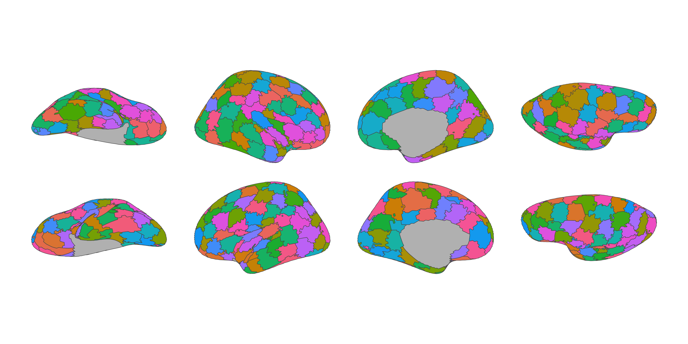
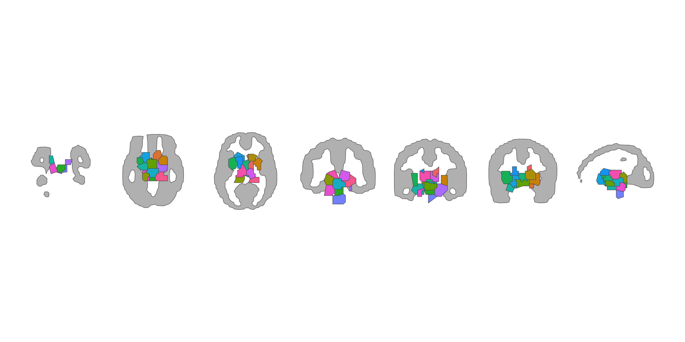
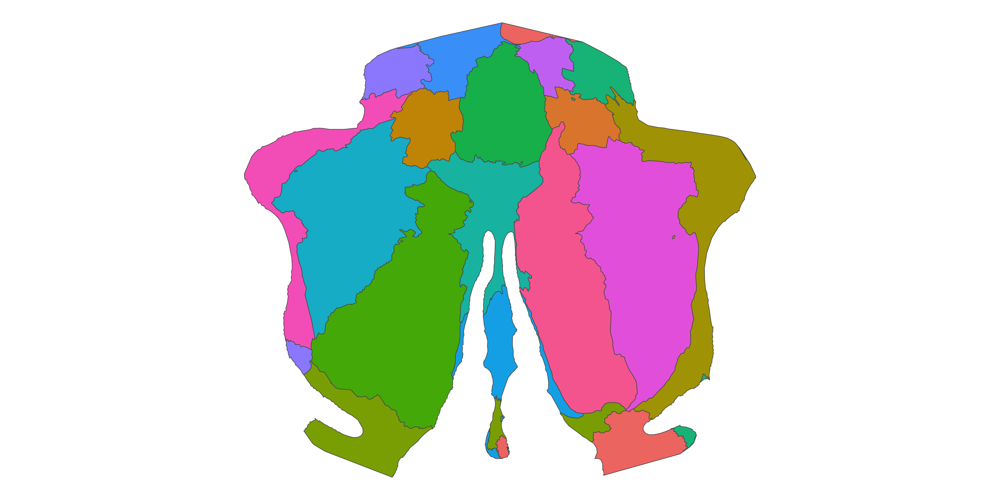
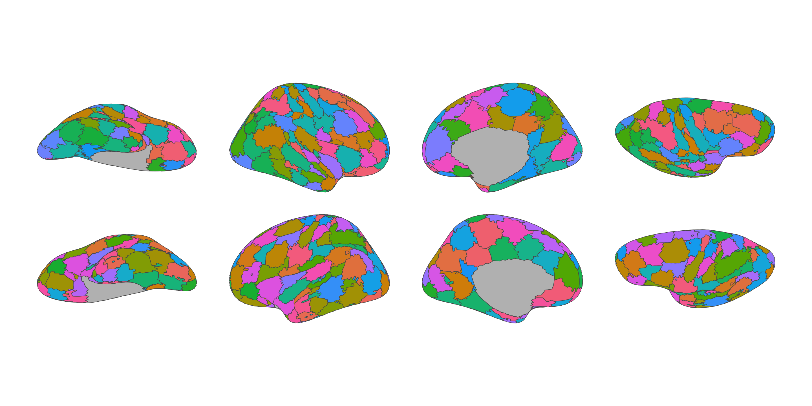
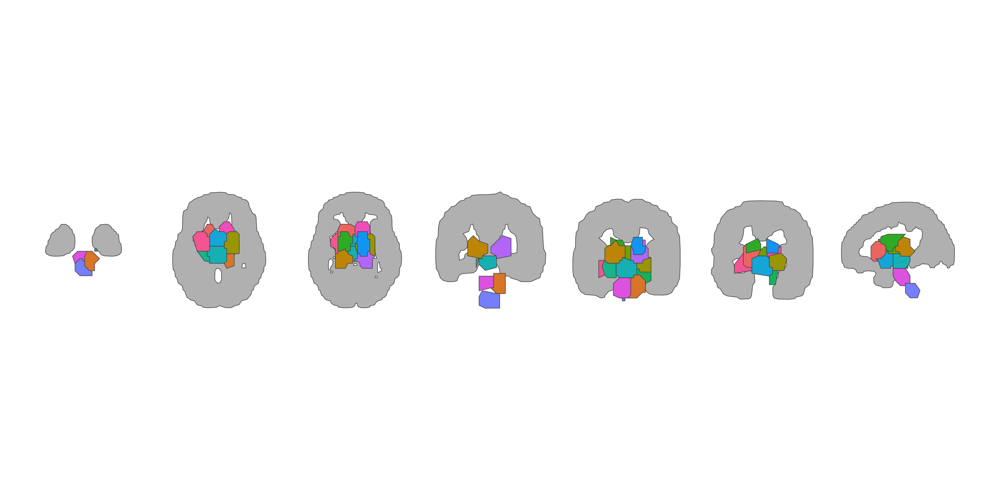
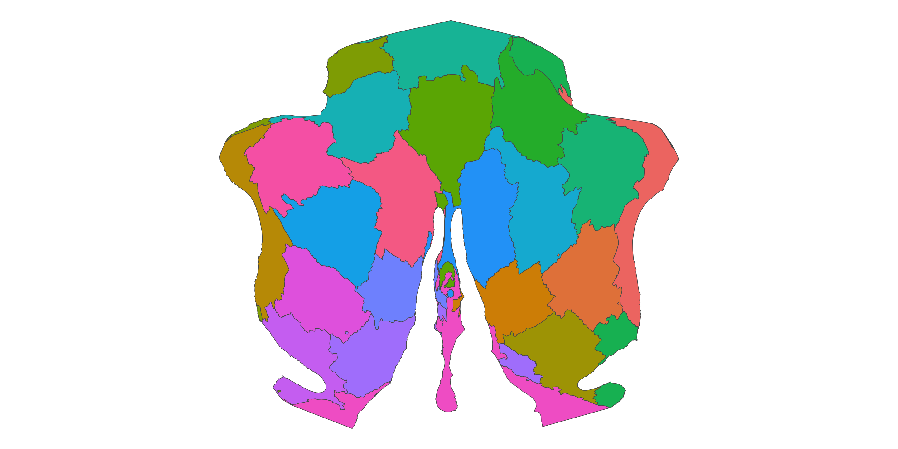
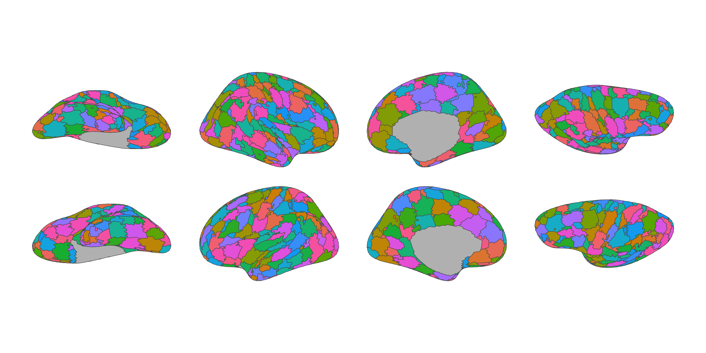
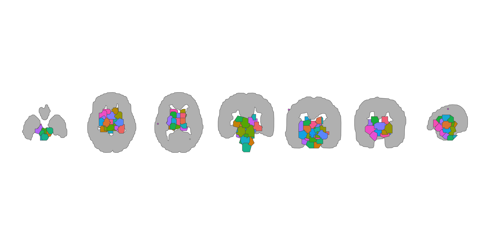
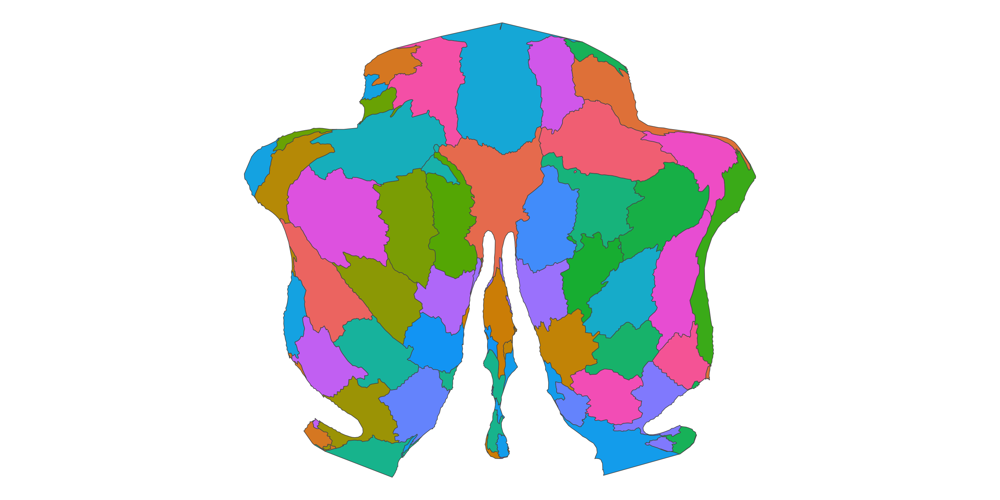

<!-- README.md is generated from README.qmd. Please edit that file -->

# ggsegCraddock

<!-- badges: start -->

[](https://github.com/ggsegverse/ggsegCraddock/actions/workflows/R-CMD-check.yaml)
[](https://ggseg.r-universe.dev/ggsegCraddock)
<!-- badges: end -->

Craddock and ADHD-200 spatially constrained spectral clustering
parcellations for the ggseg ecosystem.

Craddock RC, James GA, Holtzheimer PE, Hu XP, & Mayberg HS (2012). A
whole brain fMRI atlas generated via spatially constrained spectral
clustering. *Human Brain Mapping*, 33(8), 1914-1928.

## Installation

We recommend installing the ggseg-atlases through the ggseg
[r-universe](https://ggseg.r-universe.dev/ui#builds):

``` r
options(repos = c(
  ggseg = "https://ggseg.r-universe.dev",
  CRAN = "https://cloud.r-project.org"
))

install.packages("ggsegCraddock")
```

You can install this package from [GitHub](https://github.com/) with:

``` r
# install.packages("pak")
pak::pak("ggsegverse/ggsegCraddock")
```

## Craddock 200 cortical

``` r
library(ggseg)
library(ggseg.formats)
library(ggsegCraddock)
library(ggplot2)

atlas <- craddock200_cortical()

ggplot() +
  geom_brain(
    atlas = atlas,
    mapping = aes(fill = label),
    position = position_brain(hemi ~ view),
    show.legend = FALSE
  ) +
  scale_fill_brain_manual(atlas_palette(atlas)) +
  theme_void()
```



## Craddock 200 subcortical

``` r
atlas <- craddock200_subcortical()

ggplot() +
  geom_brain(
    atlas = atlas,
    mapping = aes(fill = label),
    position = position_brain(. ~ view),
    show.legend = FALSE
  ) +
  scale_fill_brain_manual(atlas_palette(atlas)) +
  theme_void()
```



## Craddock 200 cerebellar

``` r
atlas <- craddock200_cerebellar()

ggplot() +
  geom_brain(
    atlas = atlas,
    mapping = aes(fill = label),
    show.legend = FALSE
  ) +
  scale_fill_brain_manual(atlas_palette(atlas)) +
  theme_void()
```



## ADHD-200 200 cortical

``` r
atlas <- adhd200_200_cortical()

ggplot() +
  geom_brain(
    atlas = atlas,
    mapping = aes(fill = label),
    position = position_brain(hemi ~ view),
    show.legend = FALSE
  ) +
  scale_fill_brain_manual(atlas_palette(atlas)) +
  theme_void()
```



## ADHD-200 200 subcortical

``` r
atlas <- adhd200_200_subcortical()

ggplot() +
  geom_brain(
    atlas = atlas,
    mapping = aes(fill = label),
    position = position_brain(. ~ view),
    show.legend = FALSE
  ) +
  scale_fill_brain_manual(atlas_palette(atlas)) +
  theme_void()
```



## ADHD-200 200 cerebellar

``` r
atlas <- adhd200_200_cerebellar()

ggplot() +
  geom_brain(
    atlas = atlas,
    mapping = aes(fill = label),
    show.legend = FALSE
  ) +
  scale_fill_brain_manual(atlas_palette(atlas)) +
  theme_void()
```



## ADHD-200 400 cortical

``` r
atlas <- adhd200_400_cortical()

ggplot() +
  geom_brain(
    atlas = atlas,
    mapping = aes(fill = label),
    position = position_brain(hemi ~ view),
    show.legend = FALSE
  ) +
  scale_fill_brain_manual(atlas_palette(atlas)) +
  theme_void()
```



## ADHD-200 400 subcortical

``` r
atlas <- adhd200_400_subcortical()

ggplot() +
  geom_brain(
    atlas = atlas,
    mapping = aes(fill = label),
    position = position_brain(. ~ view),
    show.legend = FALSE
  ) +
  scale_fill_brain_manual(atlas_palette(atlas)) +
  theme_void()
```



## ADHD-200 400 cerebellar

``` r
atlas <- adhd200_400_cerebellar()

ggplot() +
  geom_brain(
    atlas = atlas,
    mapping = aes(fill = label),
    show.legend = FALSE
  ) +
  scale_fill_brain_manual(atlas_palette(atlas)) +
  theme_void()
```



## Data source

Craddock RC, James GA, Holtzheimer PE, Hu XP, & Mayberg HS (2012). A
whole brain fMRI atlas generated via spatially constrained spectral
clustering. *Human Brain Mapping*, 33(8), 1914-1928.
[doi:10.1002/hbm.21333](https://doi.org/10.1002/hbm.21333)
