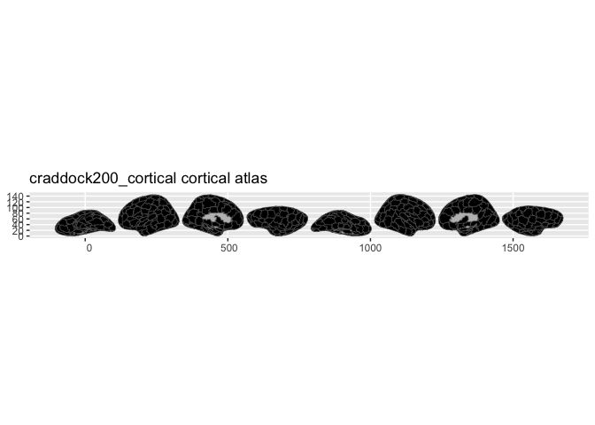
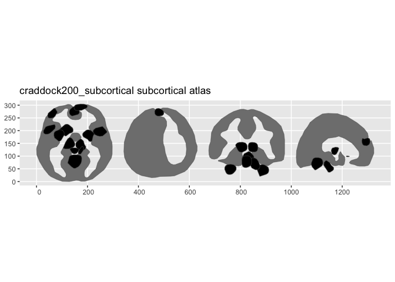
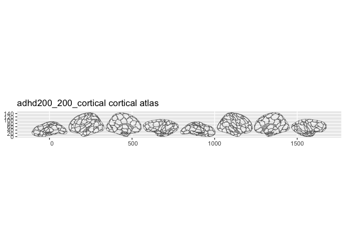
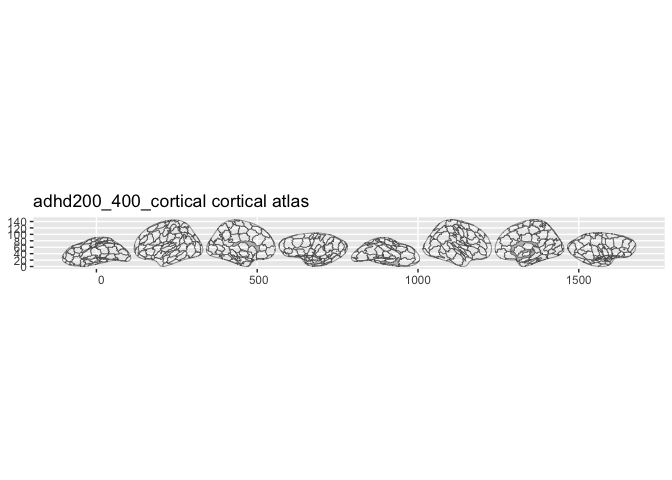

# ggsegCraddock

Craddock spatially constrained spectral clustering parcellations for the
ggsegverse Ecosystem.

## Installation

``` r
# From r-universe
install.packages("ggsegCraddock", repos = "https://ggsegverse.r-universe.dev")

# From GitHub
# install.packages("remotes")
remotes::install_github("ggsegverse/ggsegCraddock")
```

## Available atlases

| Atlas          | Cortical                                                                                            | Subcortical                                                                                               |
|----------------|-----------------------------------------------------------------------------------------------------|-----------------------------------------------------------------------------------------------------------|
| Craddock 200   | [`craddock200_cortical()`](https://ggseg.github.io/ggsegCraddock/reference/craddock200_cortical.md) | [`craddock200_subcortical()`](https://ggseg.github.io/ggsegCraddock/reference/craddock200_subcortical.md) |
| ADHD-200 CC200 | `adhd200_200_cortical()`                                                                            | `adhd200_200_subcortical()`                                                                               |
| ADHD-200 CC400 | `adhd200_400_cortical()`                                                                            | `adhd200_400_subcortical()`                                                                               |

## Craddock 200

``` r
library(ggsegCraddock)
plot(craddock200_cortical())
```



``` r
plot(craddock200_subcortical())
```



## ADHD-200 CC200

``` r
plot(adhd200_200_cortical())
```



## ADHD-200 CC400

``` r
plot(adhd200_400_cortical())
```



## Data source

- **Craddock 200**: [NITRC](https://www.nitrc.org/projects/cluster_roi/)
- **ADHD-200 CC200/CC400**:
  [NITRC](https://www.nitrc.org/frs/?group_id=427)

**Reference**: Craddock RC, et al. (2012). A whole brain fMRI atlas
generated via spatially constrained spectral clustering. *Human Brain
Mapping*, 33(8):1914-1928.
[doi:10.1002/hbm.21333](https://doi.org/10.1002/hbm.21333)
